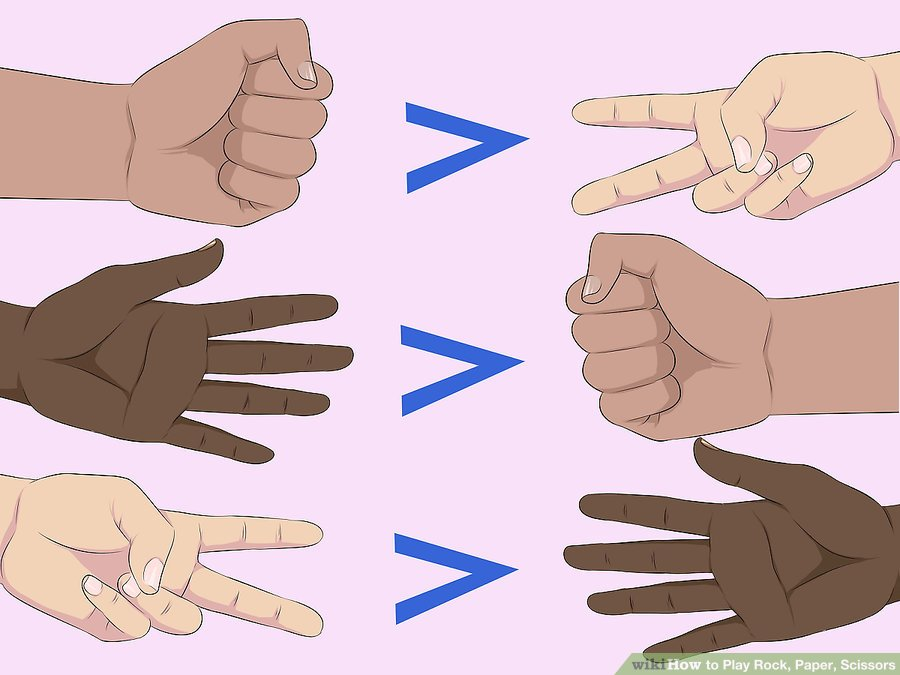
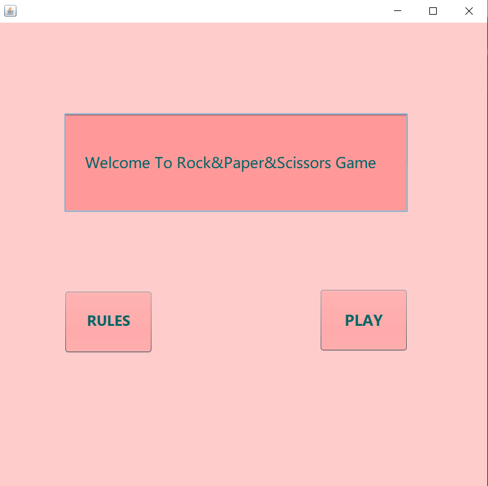
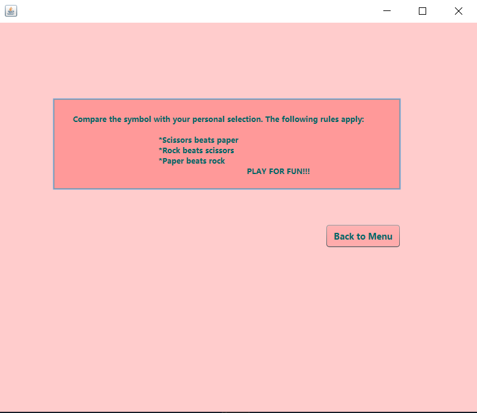
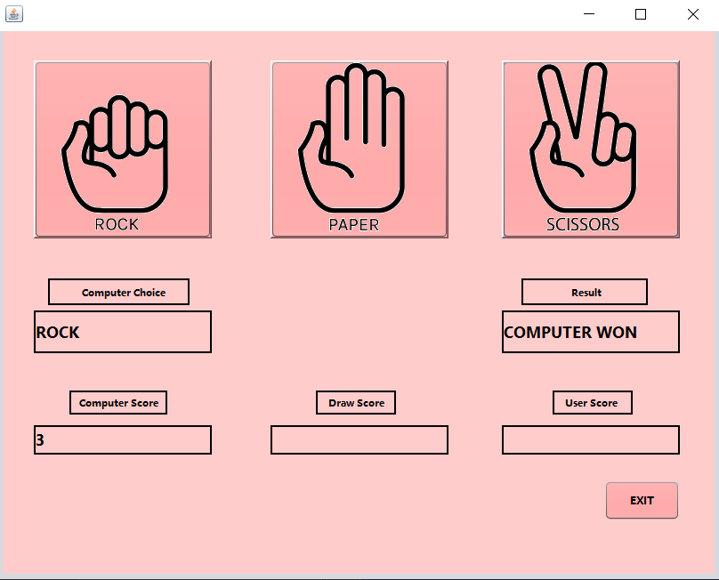

# RockPaperScissors
The rules require that competing players use one hand to form one of three shapes at an agreed-upon time. The person that plays the strongest “object” is the winner of the game. It's that easy! Rock, Paper, Scissors is a simple game that anybody can play and win. There is no intrinsic advantage to the stronger, older, or more experienced opponent.
The game's rule and screenshots have been added here.
 
 
 
 
